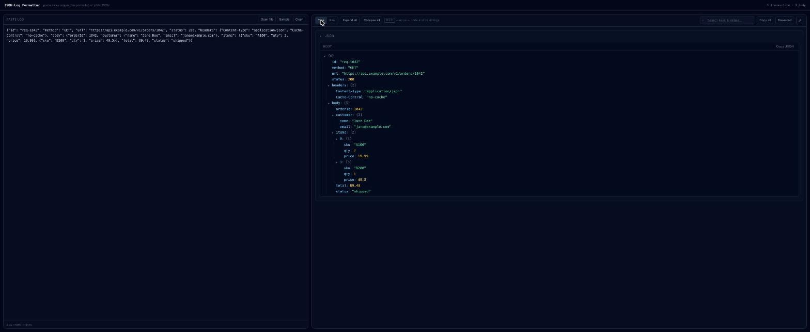
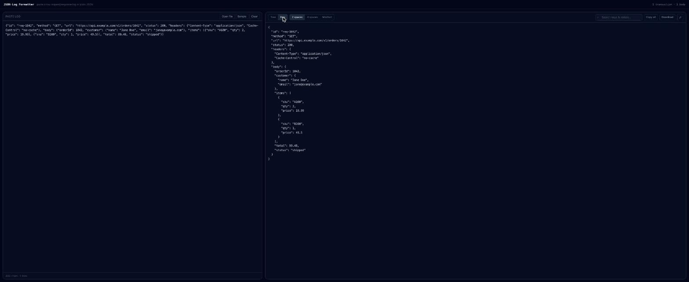

# JSON · Log Formatter

A fast, in-browser viewer for messy API logs and raw JSON. Paste a request/response log — or just a JSON body — and get a clean, collapsible, searchable tree instead of a wall of text.

[](https://github.com/AbdallaTarek/JsonFormatter/actions/workflows/deploy.yml)

**Live demo → [abdallatarek.github.io/JsonFormatter](https://abdallatarek.github.io/JsonFormatter/)**

Nothing you paste ever leaves your browser: parsing happens entirely client-side, and your last input is kept in `localStorage` so a refresh won't lose your work.

## Screenshots

**Tree view** — structured, syntax-highlighted, and collapsible



**Raw view** — the same payload, cleanly re-indented



## What it handles

| Input | What happens |
| --- | --- |
| **Log block** | Strips the box-drawing gutter, then pulls out method, URL, query params, headers, status, and timing. A request and response sharing the same `[id]` are paired into one card. |
| **Bare JSON** | Paste just a body and it renders straight into the tree. |
| **RTF** | Paste directly from a `.rtf` file (or drop the file in) — it's unwrapped automatically before parsing. |
| **Broken JSON** | Trailing commas, `//` comments, and unquoted keys are auto-repaired and flagged. Anything unrecoverable falls back to raw text with the failing line highlighted. |
| **Packed strings** | Delimiter-separated values (e.g. `A~B~C`) get an expandable toggle that splits them into numbered parts — works positionally, for any format. |

## Interacting with the tree

- Click an arrow (or its key) to toggle a single node.
- Shift-click an arrow to toggle that node and its sibling branches one level deep.
- Shift-click a REQUEST/RESPONSE header to toggle an entire card at once.
- Use **Expand all** / **Collapse all** in the toolbar to affect the whole tree.
- Large payloads (300+ branches) load partially collapsed for performance, and searching always surfaces matches even if they're inside a collapsed branch.

A dedicated reading mode hides the paste box and page header so wide payloads get the full window; press `Esc` to return.

## Getting started

Requires [Node.js](https://nodejs.org/) 20+.

```bash
npm install
npm run dev        # starts the dev server at http://localhost:5173
```

### Testing

```bash
npm test                  # parser, render, and interaction tests (jsdom)
npm run e2e                # drives real Chrome against the dev server
npm run e2e -- --headful   # ...and watch it run
```

### Production build

```bash
npm run build       # static output in dist/
```

## Project structure

```
src/
├── lib/
│   ├── rtf.js          # RTF → plain text
│   ├── logParser.js     # text → transactions (gutter, sections, headers, bodies)
│   ├── jsonParse.js     # tolerant JSON.parse with auto-repair
│   └── delimited.js     # packed-string detection and splitting
└── components/
    ├── InputPane.jsx
    ├── Toolbar.jsx
    ├── TransactionCard.jsx
    ├── HeadersTable.jsx
    ├── JsonTree.jsx
    └── DelimitedString.jsx
```

## Tech stack

React 19, Vite 7, Tailwind CSS, Vitest, and Puppeteer for end-to-end tests. Deployed automatically to GitHub Pages on every push to `main`.

## Contributing

Issues and pull requests are welcome. Please run `npm test` and `npm run e2e` before submitting a change.
